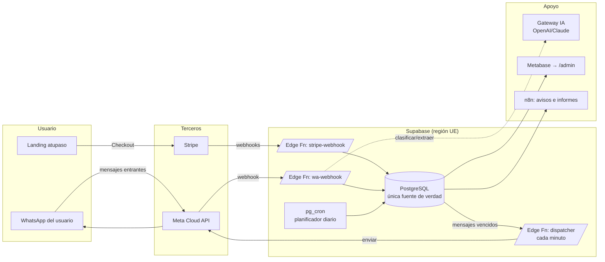
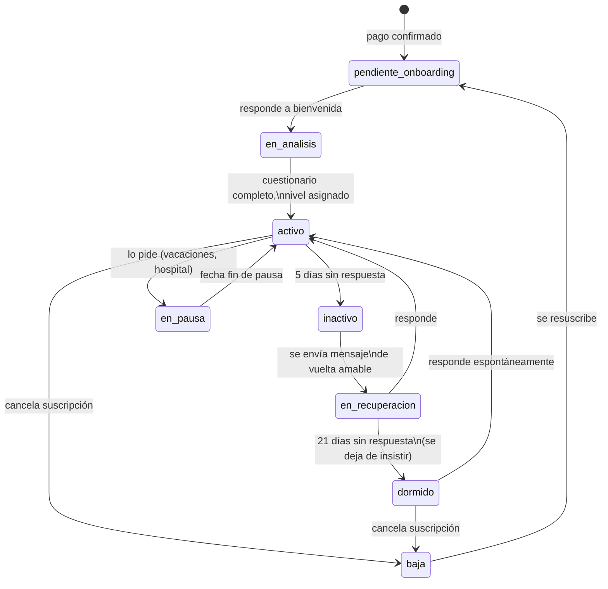

# A Tu Paso — Arquitectura técnica del sistema

> Especificación de referencia para pasar de 10 a 10.000 clientes sin rehacer
> la arquitectura. La base de datos es la única fuente de la verdad; WhatsApp
> es solo un canal; Stripe solo gestiona pagos; la IA nunca es fuente de verdad.

---

## 0. Cuatro decisiones que corrijo antes de empezar

Estas cuatro decisiones del planteamiento inicial limitarían el crecimiento.
Las señalo primero porque condicionan todo lo demás.

### 0.1 El número personal (Opción A) es inviable para automatizar

La app WhatsApp Business del móvil **no tiene API oficial**. Automatizarla
exige bots no oficiales que violan los términos de Meta y acaban en **baneo
del número** — un riesgo mortal para un negocio cuyo único canal es WhatsApp.

**Decisión: Opción B con la WhatsApp Business Cloud API de Meta** (API
oficial, gratuita como plataforma, se paga por conversación) sobre un número
dedicado. El número vive en `app_config` como parámetro (`wa_phone_number_id`):
cambiar de número es cambiar una fila, no tocar código.

Consecuencia de diseño que hay que abrazar desde el día 1: la **ventana de
24 horas**. Meta solo permite mensajes de texto libre durante las 24 h
siguientes al último mensaje *del usuario*. Fuera de esa ventana, solo se
pueden enviar **plantillas pre-aprobadas** (template messages, con coste por
conversación ~0,03-0,06 €). El "momento de hoy" diario será una plantilla
aprobada; la respuesta del usuario ("Hecho 🙂") reabre la ventana y convierte
el resto del día en conversación gratuita. El motor de mensajes (§7) trata
esto como regla de primera clase.

### 0.2 Un único estado por usuario mezcla dos cosas distintas

"Pago recibido", "Activo", "Inactivo" y "Cancelado" mezclan **facturación**
(la gobierna Stripe) con **actividad** (la gobierna el comportamiento en
WhatsApp). Un usuario puede estar `pagando + inactivo` (¡el caso más
importante de detectar!) o `impagado + activo`. Con un solo campo, esos
estados son inexpresables.

**Decisión: dos máquinas de estados ortogonales** por usuario:
- `subscription_status` — espejo de Stripe, actualizado solo por webhooks.
- `journey_status` — el recorrido vital (onboarding → activo → inactivo →
  recuperación...), actualizado solo por el motor de eventos.

Cada una tiene exactamente un valor por usuario y su propio historial.

### 0.3 n8n no debe ser el núcleo, solo la periferia

n8n es excelente para prototipar, pero la lógica crítica de negocio en un
editor visual es difícil de versionar, testear y depurar, y se convierte en
deuda técnica hacia los 1.000 usuarios.

**Decisión:** el núcleo (webhooks de Stripe y WhatsApp, motor de mensajes,
transiciones de estado) vive en **código versionado en este repositorio**
(Supabase Edge Functions + funciones SQL). n8n queda como herramienta
opcional para flujos periféricos de baja criticidad (avisarte por
Telegram/email, informes semanales), donde su velocidad de montaje compensa.
Si un flujo de n8n se vuelve crítico, se migra a código.

### 0.4 Los datos de este negocio rozan la categoría "salud" del RGPD

Respuestas tipo "me duele la rodilla" son potencialmente **datos de salud**
(categoría especial, art. 9 RGPD). La estrategia es **minimización**: el
sistema clasifica y actúa, pero no construye historiales médicos. Nada de
campos "patologías" o "diagnóstico". Si un mensaje contiene información
médica, se genera una alerta para intervención humana y el dato queda solo
como texto del mensaje (borrable), nunca estructurado como perfil de salud.
Consentimiento explícito en el onboarding. Detalle en §10.

---

## 1. Visión general



Principio operativo: **todo lo que ocurre se registra como evento en la BD, y
todo lo que se envía sale de una cola en la BD**. Los webhooks solo escriben;
un despachador único lee y envía. Así el sistema es reconstruible, auditable
e idempotente.

## 2. Stack y justificación

| Pieza | Elección | Por qué |
|---|---|---|
| BD + backend | **Supabase (PostgreSQL, región UE)** | Postgres gestionado con auth, RLS, Edge Functions, `pg_cron` y backups. Un solo proveedor para el 90 % del backend. Gratis hasta ~mil usuarios. |
| Web | **Next.js en Vercel** (ya construido) | Sin cambios. La API de checkout ya existe. |
| Pagos | **Stripe** (ya integrado) | Se añaden webhooks. Stripe es la verdad *del cobro*; la BD, la verdad *del negocio*. |
| WhatsApp | **Meta WhatsApp Business Cloud API** | Única vía oficial automatizable. Sin intermediario (BSP) al principio: menos coste y una dependencia menos. Si algún día hace falta soporte multi-canal, Twilio/360dialog encajan sin tocar el diseño (el canal es un adaptador, §7). |
| Automatización núcleo | **Edge Functions + SQL + pg_cron** | Versionado, testeable, barato, sin servidor que mantener. |
| Automatización periferia | **n8n** (opcional) | Avisos al fundador, informes. Nunca lógica de negocio. |
| IA | **Gateway propio** sobre OpenAI (o Claude) | El proveedor y el modelo son configuración (`app_config`), no arquitectura. Empezar con un modelo barato de clasificación. |
| Dashboard | **Metabase** (fase 2) → `/admin` propio (fase 4) | No construir dashboards a mano el día 1: Metabase lee vistas SQL y da KPIs en horas. |

## 3. Base de datos

Convenciones: `snake_case`, PK `uuid` (`gen_random_uuid()`) salvo tablas de
alto volumen (`bigint identity`), `created_at timestamptz default now()` en
todas, RLS activado con acceso solo por rol de servicio (§10).

### 3.1 Esquema

```sql
-- ============ CONFIGURACIÓN ============
create table app_config (
  key        text primary key,          -- 'wa_phone_number_id', 'ai_model', 'send_hour'
  value      jsonb not null,
  updated_at timestamptz not null default now()
);

-- ============ CATÁLOGOS ============
create table levels (
  id          smallint primary key,     -- 1=sentado, 2=de_pie, 3=activo (v1)
  code        text unique not null,
  name        text not null,
  description text,
  sort_order  smallint not null
);

create table exercises (
  id                uuid primary key default gen_random_uuid(),
  code              text unique not null,      -- 'silla_5x', legible en logs
  name              text not null,
  objective         text not null,             -- 'fuerza piernas', 'movilidad hombro'
  category          text not null,             -- fuerza | movilidad | equilibrio | respiración
  level_id          smallint not null references levels(id),
  duration_minutes  smallint not null default 3,
  message_body      text not null,             -- texto del "momento de hoy"
  easier_variant    text not null,             -- "si te cuesta…"
  harder_variant    text not null,             -- "si te resulta fácil…"
  expected_response text not null default 'confirmacion',  -- qué se espera
  evaluation        jsonb not null,            -- reglas: {"done":["hecho","✅"],"hard":["me costó"],...}
  on_success        jsonb not null,            -- {"points":1,"template":"celebracion_suave"}
  on_failure        jsonb not null,            -- {"template":"sin_culpa","flag_review":true}
  is_active         boolean not null default true,
  created_at        timestamptz not null default now(),
  updated_at        timestamptz not null default now()
);
create index on exercises (level_id) where is_active;

create table exercise_dependencies (         -- "no enviar B antes de dominar A"
  exercise_id   uuid references exercises(id),
  depends_on_id uuid references exercises(id),
  primary key (exercise_id, depends_on_id)
);

create table message_templates (
  id            uuid primary key default gen_random_uuid(),
  code          text unique not null,   -- 'bienvenida', 'recordatorio_suave', 'pago_fallido'
  body          text not null,          -- con variables {{nombre}}, {{dias}}
  meta_template text,                   -- nombre de la plantilla aprobada en Meta (si aplica fuera de ventana 24h)
  is_active     boolean not null default true
);

-- ============ PERSONAS ============
create type subscription_status as enum
  ('incomplete','active','past_due','canceled');
create type journey_status as enum
  ('pendiente_onboarding','en_analisis','activo','en_pausa',
   'inactivo','en_recuperacion','dormido','baja');

create table users (
  id                  uuid primary key default gen_random_uuid(),
  full_name           text,
  whatsapp_e164       text unique not null,          -- +34600111222 (quien RECIBE)
  timezone            text not null default 'Europe/Madrid',
  is_gift             boolean not null default false,
  buyer_name          text,                          -- si es regalo
  buyer_email         text,
  stripe_customer_id  text unique,
  subscription_status subscription_status not null default 'incomplete',
  journey_status      journey_status not null default 'pendiente_onboarding',
  current_level_id    smallint references levels(id),
  care_days_total     integer not null default 0,    -- caché del contador (la verdad: user_exercises)
  last_inbound_at     timestamptz,                   -- gobierna la ventana 24h
  last_completed_at   timestamptz,
  consent_at          timestamptz,                   -- RGPD: cuándo aceptó
  deleted_at          timestamptz,                   -- borrado lógico / anonimización
  created_at          timestamptz not null default now(),
  updated_at          timestamptz not null default now()
);
create index on users (journey_status) where deleted_at is null;
create index on users (subscription_status) where deleted_at is null;

create table subscriptions (
  id                     uuid primary key default gen_random_uuid(),
  user_id                uuid not null references users(id),
  stripe_subscription_id text unique not null,
  status                 subscription_status not null,
  current_period_end     timestamptz,
  cancel_at_period_end   boolean not null default false,
  created_at             timestamptz not null default now(),
  updated_at             timestamptz not null default now()
);

create table payments (
  id                uuid primary key default gen_random_uuid(),
  user_id           uuid not null references users(id),
  stripe_invoice_id text unique not null,
  amount_cents      integer not null,
  currency          text not null default 'eur',
  status            text not null,              -- paid | failed | refunded
  paid_at           timestamptz,
  created_at        timestamptz not null default now()
);
create index on payments (user_id, created_at desc);

-- ============ CONVERSACIÓN ============
create type msg_direction as enum ('in','out');
create type msg_status as enum
  ('received','queued','sent','delivered','read','failed');

create table messages (
  id            bigint generated always as identity primary key,
  user_id       uuid not null references users(id),
  direction     msg_direction not null,
  wa_message_id text unique,                 -- idempotencia con Meta
  template_id   uuid references message_templates(id),
  body          text not null,
  status        msg_status not null,
  error         text,
  created_at    timestamptz not null default now()
);
create index on messages (user_id, created_at desc);

create table scheduled_messages (            -- LA COLA DE SALIDA (outbox)
  id              bigint generated always as identity primary key,
  user_id         uuid not null references users(id),
  template_id     uuid references message_templates(id),
  exercise_id     uuid references exercises(id),
  payload         jsonb not null default '{}',   -- variables ya resueltas
  due_at          timestamptz not null,
  status          text not null default 'pending', -- pending|processing|sent|cancelled|failed
  attempts        smallint not null default 0,
  last_error      text,
  idempotency_key text unique not null,       -- p. ej. 'daily:USER:2026-07-12'
  created_at      timestamptz not null default now()
);
create index on scheduled_messages (due_at) where status = 'pending';

-- ============ ACTIVIDAD ============
create type exercise_result as enum
  ('pending','done','done_easier','done_harder','skipped','struggled');

create table user_exercises (                -- un "momento" enviado a un usuario
  id            bigint generated always as identity primary key,
  user_id       uuid not null references users(id),
  exercise_id   uuid not null references exercises(id),
  scheduled_for date not null,
  sent_at       timestamptz,
  responded_at  timestamptz,
  result        exercise_result not null default 'pending',
  response_text text,
  evaluated_by  text,                        -- rule | ai | human
  unique (user_id, scheduled_for)            -- máximo un momento al día
);
create index on user_exercises (user_id, scheduled_for desc);

create table user_level_history (
  id            bigint generated always as identity primary key,
  user_id       uuid not null references users(id),
  from_level_id smallint references levels(id),
  to_level_id   smallint not null references levels(id),
  reason        text not null,               -- 'onboarding', 'auto:7d_faciles', 'manual'
  changed_by    text not null,               -- system | ai | human
  created_at    timestamptz not null default now()
);

create table journey_history (               -- auditoría de estados
  id          bigint generated always as identity primary key,
  user_id     uuid not null references users(id),
  from_status journey_status,
  to_status   journey_status not null,
  reason      text not null,
  created_at  timestamptz not null default now()
);

-- ============ EVENTOS Y ALERTAS ============
create table events (                        -- registro append-only de TODO
  id          bigint generated always as identity primary key,
  user_id     uuid references users(id),
  type        text not null,                 -- 'stripe.checkout_completed', 'wa.inbound', ...
  payload     jsonb not null default '{}',
  created_at  timestamptz not null default now()
);
create index on events (type, created_at desc);
create index on events (user_id, created_at desc);

create table alerts (                        -- cosas que requieren un humano
  id          bigint generated always as identity primary key,
  user_id     uuid references users(id),
  type        text not null,                 -- 'mencion_salud', 'riesgo_abandono', 'pago_fallido_3'
  severity    text not null default 'media', -- baja | media | alta
  status      text not null default 'abierta',
  payload     jsonb not null default '{}',
  created_at  timestamptz not null default now(),
  resolved_at timestamptz
);
create index on alerts (status, severity);
```

### 3.2 Reglas de oro del esquema

1. **`events` es append-only**: nunca se actualiza ni borra. Es la auditoría
   y el registro con el que se puede reconstruir cualquier estado.
2. **`scheduled_messages` es la única puerta de salida**: nada envía a Meta
   directamente; todo pasa por la cola con clave de idempotencia (un fallo o
   un reintento jamás duplica un mensaje al usuario).
3. **`care_days_total` es caché**: la verdad es
   `count(*) from user_exercises where result in ('done','done_easier','done_harder')`.
   Un trigger lo mantiene; una función lo puede recalcular.
4. Los `jsonb` de `exercises` (`evaluation`, `on_success`, `on_failure`)
   permiten cambiar el comportamiento de un ejercicio **editando datos, no
   código** — el requisito de "nunca programar ejercicios en el código".

## 4. Estados del usuario

### 4.1 `subscription_status` (lo escribe solo el webhook de Stripe)

`incomplete → active → past_due → active | canceled`

### 4.2 `journey_status` (lo escribe solo el motor de eventos)



Transiciones válidas escritas en una única función SQL
(`fn_transition_journey(user_id, to_status, reason)`) que valida el paso,
actualiza `users`, inserta en `journey_history` y emite el evento. Ninguna
otra pieza del sistema toca ese campo. **Nota de marca**: `dormido` existe
para *dejar de insistir* — perseguir a quien no responde va contra A Tu Paso.

## 5. Sistema de niveles

- **Catálogo** en `levels` (v1: `sentado`, `de_pie`, `activo`). Añadir un
  nivel = añadir una fila + ejercicios asociados.
- **Asignación inicial**: el cuestionario de onboarding (3-4 preguntas por
  WhatsApp) se guarda como eventos; `fn_assign_initial_level(user_id)`
  puntúa y escribe en `users.current_level_id` + `user_level_history`.
- **Auto-ajuste continuo** (cada noche, pg_cron):
  - ≥ 5 resultados `done_harder` en los últimos 7 días → subir nivel.
  - ≥ 4 `struggled`/`done_easier` en los últimos 7 días → bajar nivel
    (con mensaje positivo: "vamos a afinar tus momentos", jamás "bajas").
  - Umbrales en `app_config` (`level_up_threshold`…): ajustables sin deploy.
- **Nunca manual, siempre con historial**: incluso un cambio hecho por ti a
  mano pasa por la misma función con `changed_by='human'`.

## 6. Biblioteca de ejercicios

Cumple exactamente los campos pedidos (ver `exercises` en §3.1). La
**selección del momento diario** es una función SQL determinista:

1. Ejercicios activos del nivel del usuario.
2. Excluir los ya completados en los últimos 14 días (variedad).
3. Excluir los que tengan dependencias no dominadas.
4. Rotar por categoría (no dos días seguidos de fuerza).
5. Elegir el menos enviado recientemente.

La **evaluación de la respuesta** es un pipeline de tres niveles:
regla (`evaluation` del ejercicio: "hecho", "✅", audios cortos → `done`) →
IA (texto ambiguo → clasificar) → humano (alerta si ni la IA está segura o
si hay mención de dolor/salud). El resultado siempre acaba en
`user_exercises.result` con `evaluated_by`.

**Arranque de contenido**: ~45 ejercicios (15 por nivel) cubren 2 semanas sin
repetición por nivel. Se escriben como datos semilla (`seed.sql`), no en código.

## 7. Motor de mensajes

### 7.1 Piezas

- **`message_templates`**: todos los textos del sistema (bienvenida, análisis,
  recordatorio suave 24 h, vuelta amable a los 5 días, cambio de nivel,
  celebración, pago fallido, cancelación, reactivación…). Los que puedan salir
  fuera de la ventana de 24 h llevan `meta_template` (versión aprobada por Meta).
- **`scheduled_messages`**: cola de salida con `due_at` e idempotencia.
- **Dispatcher** (Edge Function, invocada por pg_cron cada minuto): toma los
  `pending` vencidos (`for update skip locked`), decide texto libre o
  plantilla Meta según `last_inbound_at` (ventana 24 h), llama a la Cloud
  API, marca `sent`/`failed` (3 reintentos con backoff), inserta en
  `messages` y emite evento.
- **Webhook entrante** (`wa-webhook`): verifica firma, deduplica por
  `wa_message_id`, guarda en `messages`, actualiza `last_inbound_at`, emite
  `wa.inbound` → el router (§8) decide qué hacer.

### 7.2 Programación automática

- **Momento diario**: pg_cron a las 07:30 crea el `scheduled_message` del día
  (idempotency `daily:{user}:{fecha}`) para cada usuario `activo` con
  suscripción `active`, eligiendo ejercicio según §6.
- **Recordatorio suave**: si a las 20:00 no hay respuesta, un único mensaje
  amable *opcional* (configurable; por defecto desactivado — la marca no
  persigue).
- **Los estados programan al entrar**: al pasar a `inactivo` se programa la
  "vuelta amable"; al pasar a `past_due`, el mensaje de pago fallido; etc.
  Nada se envía a mano jamás.

## 8. Motor de automatizaciones (workflows)

Patrón único: **webhook/cron → evento en BD → handler → escribe BD →
(opcionalmente) encola mensajes**. Los handlers son funciones puras y
testeables.

| # | Disparador | Flujo |
|---|---|---|
| W1 | Stripe `checkout.session.completed` | upsert `users` (teléfono del pago o del campo regalo) + `subscriptions` + evento → programa plantilla `bienvenida` → `journey=pendiente_onboarding` |
| W2 | `wa.inbound` en onboarding | guarda respuesta del cuestionario → si completo: `fn_assign_initial_level` → `journey=activo` → programa primer momento para mañana |
| W3 | pg_cron 07:30 | selección de ejercicio + encolar momento diario (todos los activos) |
| W4 | `wa.inbound` de usuario activo | evaluar respuesta (regla→IA→humano) → `user_exercises.result` → contador de días (trigger) → respuesta de celebración/sin culpa según `on_success`/`on_failure` |
| W5 | pg_cron nocturno | auto-ajuste de nivel (§5) + detección de inactividad (5 días sin inbound → `inactivo` → programa vuelta amable) + 21 días → `dormido` |
| W6 | Stripe `invoice.paid` | registra pago + si venía de `past_due` → reactivar |
| W7 | Stripe `invoice.payment_failed` | `subscription=past_due` + mensaje amable de pago (el cobro lo reintenta Stripe con su dunning) → 3.º fallo: alerta |
| W8 | Stripe `customer.subscription.deleted` | `subscription=canceled`, `journey=baja`, mensaje de despedida sin culpa, cancelar mensajes pendientes |
| W9 | `alerts` insert (vía n8n o trigger) | avisarte por Telegram/email con enlace al usuario |
| W10 | pg_cron domingo | informe semanal para ti (altas, bajas, retención, alertas abiertas) |

Idempotencia en todos los webhooks: Stripe por `event.id` (tabla
`events`+unique), Meta por `wa_message_id`.

## 9. Capa de IA

**Gateway propio** (un módulo, `ai/`): entrada tipada → prompt → salida JSON
validada → escritura en BD. Proveedor y modelo en `app_config`
(`ai_provider`, `ai_model`): cambiar de OpenAI a Claude es configuración.

| Tarea | Cuándo | Escribe en |
|---|---|---|
| Clasificar intención del inbound | W4, si las reglas no deciden | `user_exercises.result` (`evaluated_by='ai'`) o rutas: pregunta / problema / charla |
| Responder dudas frecuentes | intención = pregunta, con base de conocimiento propia (tabla `faq_kb`) | `scheduled_messages` (respuesta) + `messages` |
| Detección de emoción / mención de salud | todo inbound (pasada barata) | `alerts` (tipo `mencion_salud`, severidad alta) |
| Resumen de conversación | al abrir tú una alerta | `alerts.payload.summary` |
| Riesgo de abandono | pg_cron nocturno: patrón de respuestas + latencias | `alerts` (tipo `riesgo_abandono`) |

**Límites duros** (en el prompt del sistema y en código):
1. La IA nunca da consejo médico: cualquier mención de dolor, mareo,
   medicación o lesión → alerta humana y respuesta plantilla ("mejor esto lo
   ve una persona del equipo, te escribimos enseguida").
2. La IA nunca escribe directamente a WhatsApp: encola, y en fase 3 inicial
   sus respuestas requieren tu aprobación (cola de revisión) hasta que la
   tasa de acierto justifique soltarla.
3. Toda acción de IA queda en `events` (`ai.classified`, `ai.replied`) con
   el prompt-version usado.

## 10. Dashboard

**Fase 2: Metabase** (self-host gratis o cloud) sobre vistas SQL, solo lectura:

```sql
create view v_kpis as select ... ;        -- activos, nuevos 7d, MRR, churn 30d
create view v_usuarios_atencion as ... ;  -- inactivos, past_due, alertas abiertas
create view v_engagement as ... ;         -- % respuesta diaria, racha media de días totales
```

KPIs: usuarios activos, altas/bajas semanales, MRR y renovaciones (de
`payments`), nivel medio y distribución, % de momentos respondidos, usuarios
en `inactivo`/`en_recuperacion`, alertas abiertas, retención por cohorte
mensual. **Fase 4**: panel `/admin` en el propio Next.js (Supabase Auth +
RLS de rol admin) cuando necesites *operar* (resolver alertas, ver
conversación, pausar usuarios) y no solo *mirar*.

## 11. Escalabilidad: 10 → 10.000

| Componente | 10 | 100 | 1.000 | 10.000 |
|---|---|---|---|---|
| Postgres (Supabase) | Free | Free/Pro 25 € | Pro | Pro + réplicas de lectura; particionar `messages`/`events` por mes |
| Dispatcher | 1 invocación/min sobra | igual | igual (envía en lotes) | varios workers en paralelo (`skip locked` ya lo permite) |
| WhatsApp | tier gratuito de Meta | igual | atención al **límite de conversaciones/día por calidad del número** (sube solo con buen uso) | número(s) adicionales si Meta limita; el diseño ya es multi-número (`app_config` → columna `channel_id`) |
| Coste WhatsApp (~1 plantilla/día/usuario) | ~10 €/mes | ~100 €/mes | ~1.000 €/mes → **optimizar**: si el usuario respondió hoy, el momento de mañana puede ir como texto libre gratuito dentro de la ventana | negociar BSP |
| IA | céntimos | ~10 €/mes | ~100 €/mes (clasificador barato) | cachear FAQ, modelo pequeño fine-tuneado |
| Dashboard | SQL a mano | Metabase | Metabase | `/admin` propio |
| Lo que NO cambia | esquema de BD, máquinas de estado, cola outbox, contratos de eventos, plantillas, biblioteca de ejercicios | | | |

El coste de WhatsApp es la única línea que escala linealmente con usuarios:
por eso la ventana de 24 h (respuesta diaria del usuario) no es solo
engagement, **es margen**.

## 12. Seguridad, RGPD y operaciones

- **Acceso a datos**: RLS activado en todas las tablas, `deny by default`.
  Solo el rol de servicio (Edge Functions) escribe. Metabase con usuario SQL
  de solo lectura sobre las vistas. El panel admin, con rol autenticado.
- **Secretos**: claves de Stripe/Meta/IA en variables de entorno de
  Supabase/Vercel. Jamás en el repositorio (ya aplicado con `.env.example`).
  Rotación si hay sospecha; claves de test y live separadas.
- **Backups**: Supabase Pro incluye backups diarios (retención 7-30 días) y
  PITR opcional. Además, `pg_dump` semanal automatizado a un bucket privado
  (norma 3-2-1 básica).
- **Logs y auditoría**: `events` (negocio), `journey_history` y
  `user_level_history` (estados), logs de Edge Functions (técnicos, 7 días en
  free). Todo cambio de datos sensibles tiene autor (`changed_by`).
- **Versionado**: migraciones SQL en `supabase/migrations/` en este repo;
  plantillas y ejercicios como seeds versionados; prompts de IA con
  `prompt_version` en los eventos.
- **RGPD**:
  - Región UE (Supabase eu-west, Vercel fra1).
  - Consentimiento explícito registrado (`consent_at`) en el primer mensaje.
  - Minimización de datos de salud (§0.4): sin perfiles médicos.
  - Derecho de supresión: `fn_forget_user(user_id)` — anonimiza `users`
    (nombre, teléfono → hash), borra cuerpos de `messages`, conserva
    contadores agregados y registros contables (obligación fiscal).
  - DPAs: Stripe, Meta, Supabase, Vercel y el proveedor de IA los ofrecen
    estándar. Registro de actividades de tratamiento: documento corto, te lo
    puedo redactar.
  - Actualizar la política de privacidad de la web al activar WhatsApp
    (ya está previsto en el texto actual).

## 13. Roadmap

### Fase 1 — Núcleo operativo (tú aún operas, el sistema registra)
**Orden**: (1) proyecto Supabase UE + migraciones del esquema completo →
(2) webhook Stripe (W1, W6-W8) → (3) alta en Meta Cloud API: número, verificación
de empresa, plantillas `bienvenida` y `momento_diario` aprobadas →
(4) dispatcher + webhook WhatsApp → (5) seeds: 45 ejercicios y ~15 plantillas →
(6) W3 (momento diario automático). El onboarding lo haces tú a mano desde el
móvil del negocio, pero registrándolo (los mensajes ya quedan en BD vía webhook).
**Dificultad**: media. Lo más lento es la verificación de Meta (días, empieza YA).
**Coste**: ~0-25 €/mes + conversaciones WhatsApp. **Tiempo**: 2-3 semanas.
**Dependencias**: cuenta Meta Business verificada, número nuevo.

### Fase 2 — Automatización completa (el sistema opera, tú supervisas)
**Orden**: (1) W2 onboarding automático con cuestionario → (2) W4 evaluación
por reglas + contador de días → (3) W5 niveles automáticos e inactividad →
(4) Metabase + W9/W10 (alertas e informe semanal, aquí encaja n8n).
**Dificultad**: media-alta (es la lógica de negocio fina).
**Coste**: igual + Metabase (0 € self-host). **Tiempo**: 3-4 semanas.
**Dependencias**: Fase 1 y ≥2 semanas de datos reales para calibrar umbrales.

### Fase 3 — IA (el sistema entiende)
**Orden**: (1) gateway IA + clasificador de intención/salud (con cola de
aprobación humana) → (2) FAQ automática con base de conocimiento → (3) riesgo
de abandono → (4) resúmenes. **Dificultad**: media (el esquema ya lo soporta).
**Coste**: +10-50 €/mes según volumen. **Tiempo**: 2-3 semanas.
**Dependencias**: Fase 2 y un histórico de conversaciones reales para evaluar
al clasificador antes de soltarlo.

### Fase 4 — Escalado y confort
Particionado de `messages`/`events`, panel `/admin` propio, multi-número,
tests de carga del dispatcher, PITR, fine-tuning del clasificador.
**Cuándo**: al superar ~1.000 activos o cuando Metabase se quede corto.
**Dificultad**: media. **Tiempo**: continuo, sin bloqueo de producto.

---

*Documento vivo: cualquier decisión que lo contradiga debe actualizarlo.*
